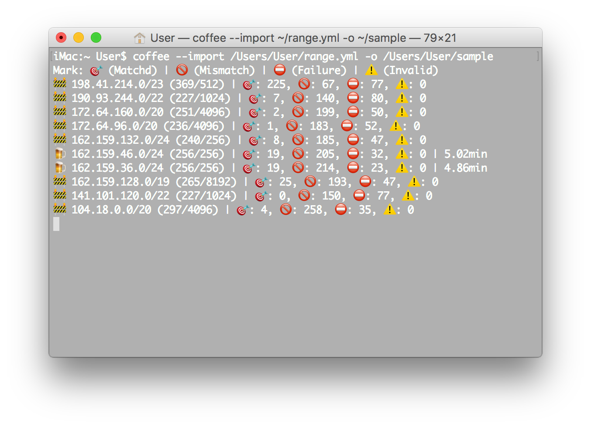

<div align = "center"></div>

<div align = "center">
  <h1>Coffee.cr - Cloudflare Edge Server Scanner</h1>
</div>

<p align="center">
  <a href="https://crystal-lang.org">
    </a>
  <a href="https://travis-ci.org/636f7374/coffee.cr">
    </a>
  <a href="https://github.com/636f7374/coffee.cr/releases">
    </a>
  <a href="https://github.com/636f7374/coffee.cr/blob/master/license">
    </a>
</p>

<div align = "center"><a href="#"></a></div>

## Description

* It can effectively reduce the time spent connecting to `Cloudflare` Pop Edge Server.
  * For now, it only supports Cloudflare (I.e. AS13335).
* It uses fiber optics to request Cloudflare Pop Edge Server in parallel.
  * It can be used as CommandLine or CrystalShard.
* If IP address caching is enabled and command line mode is disabled.
  * It will be refreshed in the fiber (default refresh every three minutes, capacity is five).
* It will skip the (I.e. IATA / Edge / Region) Pop Edge Server not specified by you.
* You don't need to scan too many IP Ranges
  * because these scan results will change after a while.

### Story

* Imagine that if you live in France, Cloudflare AnyCast causes you to connect to Pop Edge Server in the United States.
  * Which will greatly slow down your Internet speed, So what should you do?
* Fortunately, Cloudflare provides a method for detecting Pop Edge Server IATA that the server currently belongs to.
  * When requesting the Cloudflare IP address, Cloudflare will return the `CF-RAY` HTTP header, which contains `IATA`.
* In our actual tests, this will improve 2x-4x network performance.
* Since Cloudflare Pop Edge Server is floating, the geographic location will change with time, a few minutes / hours.
  * Therefore, it needs to be scanned every once in a while.
  * When it is used as a shard, it will continue to run in other fibers without interruption.

### Fact

* In actual situations, it effectively improves the access speed of our customers in mainland China.
  * Our customers can quickly connect to Cloudflare Asia Pop Edge Server (E.g. HongKong) through the built-in Coffee.cr.
  * If you are in Asia, you want to connect to Pop Edge Server in Asia instead of America, France, Amsterdam.
  * (Especially in crowded periods, the effect is very obvious).

### Features

* [X] It is thread-safe, which means you ca n’t go wrong when using multithreading.
* [X] It can be used as Command Line and Shard.
* [X] It can maximize the choice of geographic location IATA / Edge / Region.
* [X] It can increase the network speed of servers hosted on CLoudflare (Client).
* [X] Loosely coupled design, clean syntax, high performance.
* [ ] Command Line local SOCKS5 turbo server.
* [X] It can be perfectly combined with Crystal DNS Resolver: [Durian.cr](https://github.com/636f7374/durian.cr).

### Sample

* Coffee - Export

```text
{"ipAddress":"162.159.36.5","edge":"HongKong","iata":"HKG","createdAt":"2020-04-10T01:15:43.971333000Z","timing":"171.98ms"}
{"ipAddress":"162.159.36.17","edge":"HongKong","iata":"HKG","createdAt":"2020-04-10T01:15:54.726890000Z","timing":"165.72ms"}
{"ipAddress":"162.159.36.22","edge":"HongKong","iata":"HKG","createdAt":"2020-04-10T01:15:58.489802000Z","timing":"171.66ms"}
{"ipAddress":"162.159.36.31","edge":"HongKong","iata":"HKG","createdAt":"2020-04-10T01:16:07.036998000Z","timing":"173.44ms"}
{"ipAddress":"162.159.36.50","edge":"HongKong","iata":"HKG","createdAt":"2020-04-10T01:16:24.045118000Z","timing":"165.44ms"}
{"ipAddress":"162.159.36.51","edge":"HongKong","iata":"HKG","createdAt":"2020-04-10T01:16:24.207770000Z","timing":"162.49ms"}
{"ipAddress":"162.159.36.60","edge":"HongKong","iata":"HKG","createdAt":"2020-04-10T01:16:30.179999000Z","timing":"167.71ms"}
{"ipAddress":"162.159.36.84","edge":"HongKong","iata":"HKG","createdAt":"2020-04-10T01:16:48.974894000Z","timing":"474.01ms"}
{"ipAddress":"162.159.36.94","edge":"HongKong","iata":"HKG","createdAt":"2020-04-10T01:16:57.753831000Z","timing":"552.71ms"}
{"ipAddress":"162.159.36.105","edge":"HongKong","iata":"HKG","createdAt":"2020-04-10T01:17:12.610249000Z","timing":"510.71ms"}
{"ipAddress":"162.159.36.116","edge":"HongKong","iata":"HKG","createdAt":"2020-04-10T01:17:24.517550000Z","timing":"189.18ms"}
{"ipAddress":"162.159.36.123","edge":"HongKong","iata":"HKG","createdAt":"2020-04-10T01:17:30.561109000Z","timing":"487.24ms"}
{"ipAddress":"162.159.36.126","edge":"HongKong","iata":"HKG","createdAt":"2020-04-10T01:17:32.852852000Z","timing":"467.81ms"}
{"ipAddress":"162.159.36.130","edge":"HongKong","iata":"HKG","createdAt":"2020-04-10T01:17:34.701067000Z","timing":"163.06ms"}
{"ipAddress":"162.159.36.136","edge":"HongKong","iata":"HKG","createdAt":"2020-04-10T01:17:39.692680000Z","timing":"369.2ms"}
{"ipAddress":"162.159.36.169","edge":"HongKong","iata":"HKG","createdAt":"2020-04-10T01:18:05.020376000Z","timing":"178.66ms"}
{"ipAddress":"162.159.36.184","edge":"HongKong","iata":"HKG","createdAt":"2020-04-10T01:18:14.476441000Z","timing":"170.79ms"}
{"ipAddress":"162.159.36.208","edge":"HongKong","iata":"HKG","createdAt":"2020-04-10T01:18:30.982121000Z","timing":"481.95ms"}
{"ipAddress":"162.159.36.230","edge":"HongKong","iata":"HKG","createdAt":"2020-04-10T01:18:45.955359000Z","timing":"179.87ms"}
{"ipAddress":"162.159.36.234","edge":"HongKong","iata":"HKG","createdAt":"2020-04-10T01:18:49.161769000Z","timing":"176.81ms"}
{"ipAddress":"162.159.36.241","edge":"HongKong","iata":"HKG","createdAt":"2020-04-10T01:18:53.381347000Z","timing":"168.33ms"}
```

* Coffee - Import

You can specify a different export location for each scan through the configuration file.
Or use ARGV to specify a single export location.

```yaml
- ipRange: 198.41.214.0/23
  output: /Users/User/sample
  needles: asia
  timeout:
    connect: 2
    read: 2
    write: 2
  type: region
- ipRange: 190.93.244.0/22
  output: /Users/User/sample
  needles: asia
  timeout:
    connect: 2
    read: 2
    write: 2
  type: region
- ipRange: 172.64.160.0/20
  output: /Users/User/sample
  needles: asia
  timeout:
    connect: 2
    read: 2
    write: 2
  type: region
- ipRange: 172.64.96.0/20
  output: /Users/User/sample
  needles: asia
  timeout:
    connect: 2
    read: 2
    write: 2
  type: region
- ipRange: 162.159.132.0/24
  output: /Users/User/sample
  needles: asia
  timeout:
    connect: 2
    read: 2
    write: 2
  type: region
- ipRange: 162.159.46.0/24
  output: /Users/User/sample
  needles: asia
  timeout:
    connect: 2
    read: 2
    write: 2
  type: region
- ipRange: 162.159.36.0/24
  output: /Users/User/sample
  needles: asia
  timeout:
    connect: 2
    read: 2
    write: 2
  type: region
- ipRange: 162.159.128.0/19
  output: /Users/User/sample
  needles: asia
  timeout:
    connect: 2
    read: 2
    write: 2
  type: region
- ipRange: 141.101.120.0/22
  output: /Users/User/sample
  needles: asia
  timeout:
    connect: 2
    read: 2
    write: 2
  type: region
- ipRange: 104.18.0.0/20
  output: /Users/User/sample
  needles: asia
  timeout:
    connect: 2
    read: 2
    write: 2
  type: region
```

## Use Coffee

### Used as Shard

Add this to your application's shard.yml:

```yaml
dependencies:
  coffee:
    github: 636f7374/coffee.cr
```

### Usage

* Coffee - Example

```crystal
require "coffee"

config = Coffee::Config.parse ARGV
abort if config.tasks.empty?

scanner = Coffee::Scanner.new config.tasks, commandLine: true
scanner.render_pipe = STDOUT

scanner.perform
```

### Installation

```bash
$ git clone https://github.com/636f7374/coffee.cr.git
$ cd coffee.cr && make build && make install
```

## Development

```bash
$ make test
```

## Credit

* [\_Icon - Freepik/GraphicDesign](https://www.flaticon.com/packs/graphic-design-125)

## Contributors

|Name|Creator|Maintainer|Contributor|
|:---:|:---:|:---:|:---:|
|**[636f7374](https://github.com/636f7374)**|√|√||

## License

* GPLv3 License
